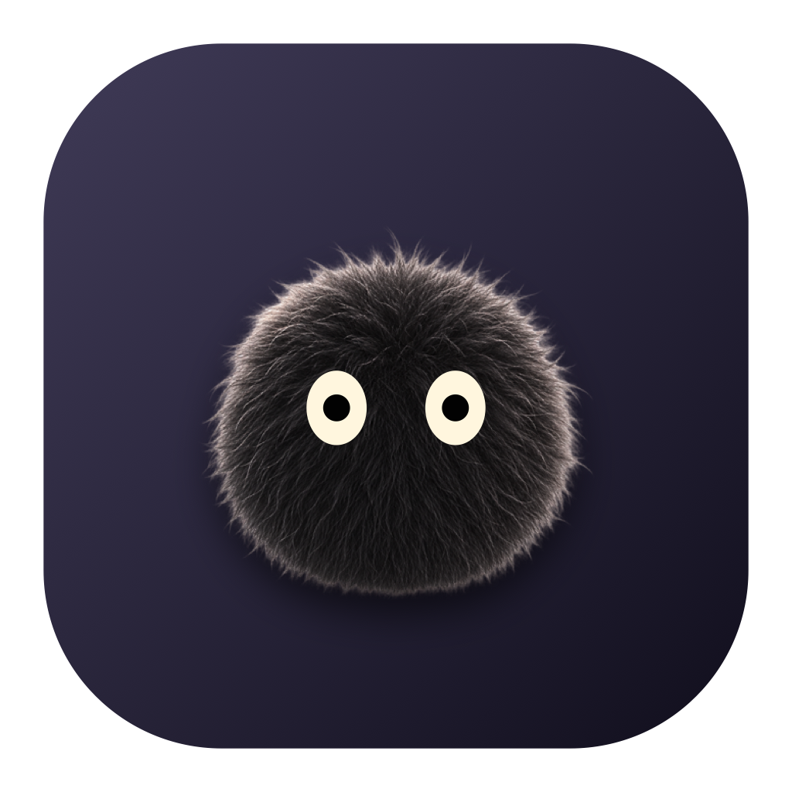
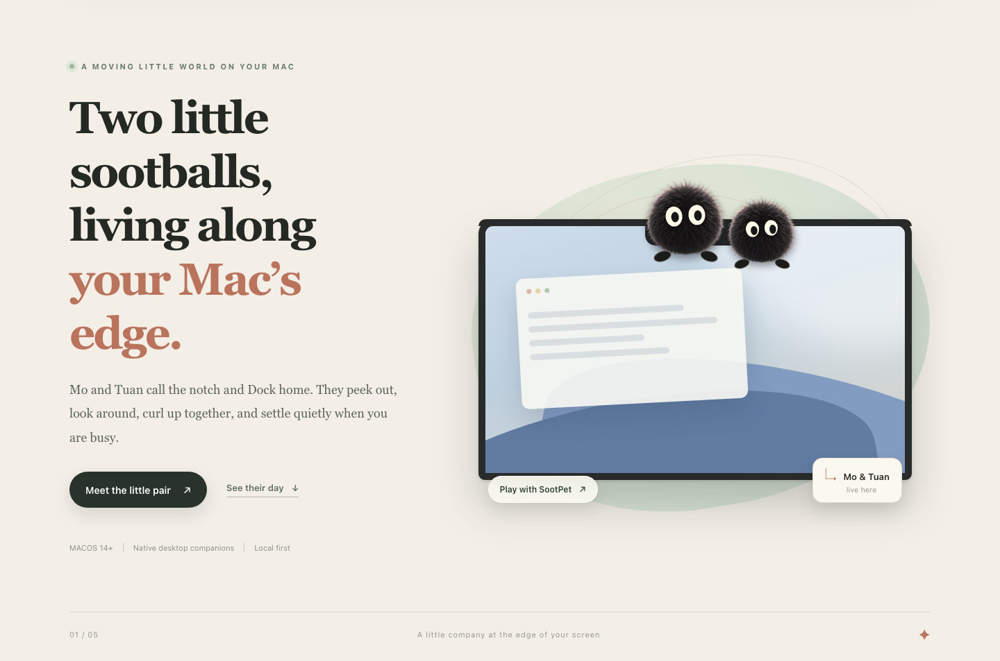
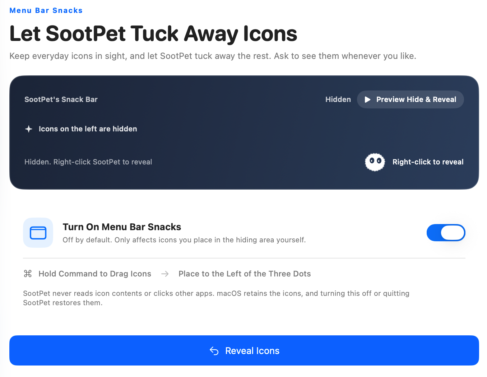
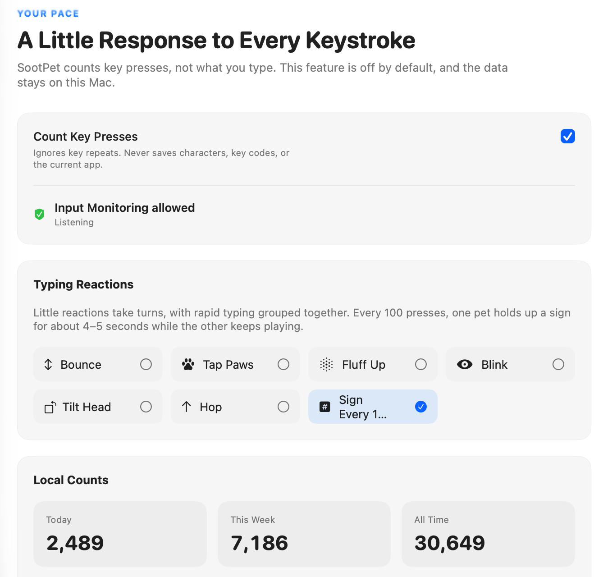
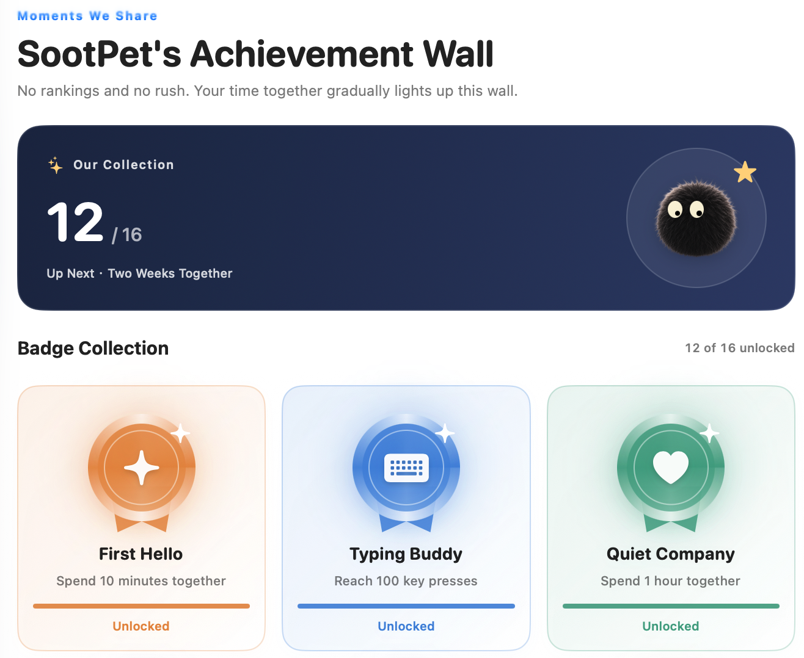
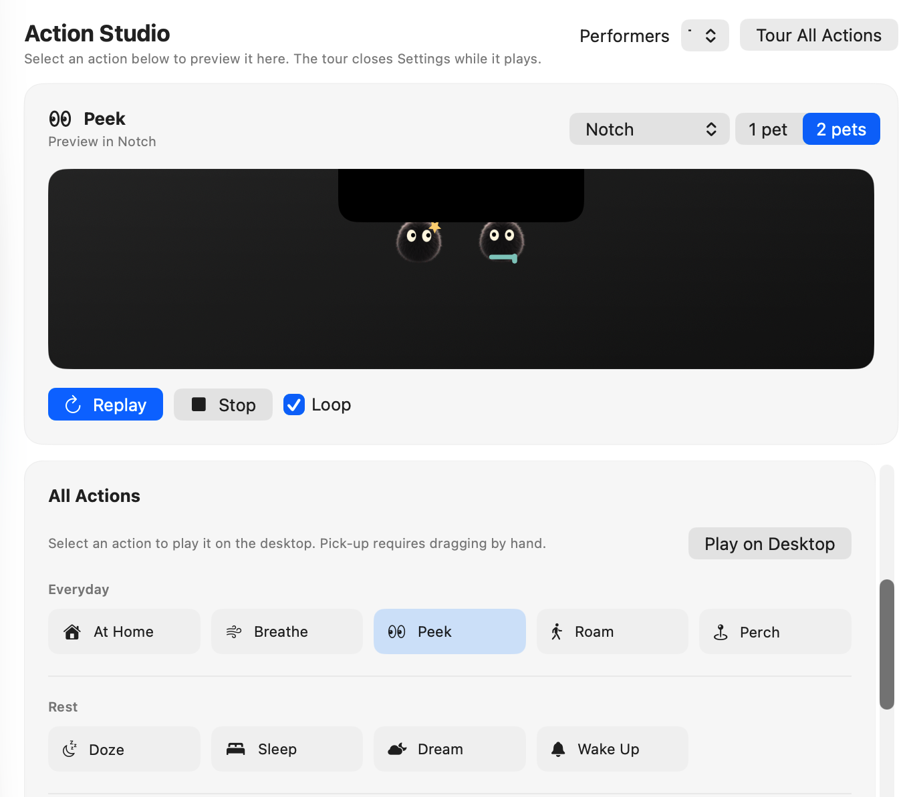

  

<h1 align="center">SootPet</h1>

Two little sootballs, living along your Mac’s edge.

  <a href="README.md">简体中文</a> · English 
  <a href="https://github.com/dean0228/sootpet-releases/releases/download/v0.0.1-build54/SootPet-0.0.1.dmg">Download the Mac fix</a> ·
  <a href="https://sootpet.com/download/mac">Official download page</a> ·
  <a href="https://github.com/dean0228/sootpet-releases/releases/tag/v0.0.1-build54">Release details</a> ·
  <a href="#installing--updating">Installation guide</a>

Mo is curious and lively. Tuan takes a little longer to warm up and loves a good nap. They call your MacBook’s notch home—or settle by the Dock on a display without a notch. Quiet when you’re busy, playful when there’s a moment: a peek, a glance, a little nudge from one to the other.

**Native to macOS · Local first · English / Simplified Chinese**

## A little company, without the interruptions

- **At home on your screen’s edge.** The notch, the Dock, or an edge you choose. Pick them up, put them down, and watch them hold on and peek around.
- **Your pace, your pair.** Choose a quiet, natural, or lively rhythm, with one companion or two. Enable Window Walking if you’d like them to explore suitable windows.
- **Focus together. Take gentle breaks.** Start a 25-minute focus session, or set the interval for gentle reminders. A little sign reminds you to stretch or look into the distance.
- **Tiny moments to enjoy.** Preview their actions, try a little star or scarf, and let them act out everyday scenes together.

## Icon snacks: a tidier menu bar

Let SootPet look after the menu bar icons you don’t need right now. Turn on Icon Snacks, hold Command, and drag those icons to the left of SootPet. Right-click to tuck them away or bring them back; left-click still opens the SootPet panel. Turning the feature off or quitting SootPet restores the icons.

## Every little tap counts

Enable key press counting to see today’s, this week’s, and your all-time totals, plus trends over the last 7 or 30 days. Every 100 presses, Mo and Tuan take turns holding up a sign for about 4–5 seconds.

It counts **key presses**, not words. What you type is never recorded.

## Small milestones, shared with your pair

Time together, focus sessions, and everyday interactions gradually light up achievement badges. Open a badge to see its story, requirements, and progress. A little recognition—not another to-do list.

Explore the Action Studio: try their little moves

Preview SootPet’s everyday scenes, choose your favorite actions, and bring them to your desktop.

*Feature images show the real app. The opening scene is a promotional illustration; statistics and progress in screenshots are demo data.*

## Your day stays on your Mac

- Key press counting, Window Walking, and Icon Snacks are off by default. You choose whether to enable them.
- Counting requires macOS Input Monitoring permission. It saves counts only—never typed text, key codes, shortcuts, or the current app.
- Window Walking uses only the information needed to locate a window, such as its position and size. It does not read titles or screen contents, or save movement history.
- Icon Snacks adjusts only SootPet’s own menu bar items. It does not read or click other apps’ icons or rewrite their system ordering preferences.
- No screen-content reading, camera or microphone access, or uploaded behavior data. Preferences and statistics are stored locally.
- Update checks and installer downloads contact GitHub without sending behavior statistics or device identifiers.

## Installing & updating

The current release is **v0.0.1 (Build 54)**, for **Apple silicon Macs (M-series) running macOS 14 or later**.

Build 54 fixes repeated Icon Snacks animations and prevents folding from shrinking the control toward the notch. Until the website mirror is updated, use the Mac fix link above; the official download endpoint may still serve Build 53.

This is an **Ad Hoc-signed public preview, not notarized by Apple**. macOS may block the first launch. Verify where you downloaded it and follow the system prompts. Do not disable Gatekeeper or other system security protections.

1. [Download SootPet-0.0.1.dmg (Build 54)](https://github.com/dean0228/sootpet-releases/releases/download/v0.0.1-build54/SootPet-0.0.1.dmg), open it, and drag SootPet into Applications.
2. If an older version is installed, quit it before replacing the app. Your names, statistics, achievements, and preferences carry over.
3. Open SootPet. If macOS blocks it, follow the prompt in System Settings → Privacy & Security to choose Open Anyway. Do this only for an installer whose source you trust.
4. Choose Follow System, Simplified Chinese, or English in Settings → App Info → App Language.
5. If counting stops after an update, allow the installed version in Input Monitoring and relaunch it as instructed by macOS.

Check for updates, read release notes, and download an installer in Settings → App Info. SootPet verifies the update manifest’s signature and the installer’s integrity before you confirm installation. This verification is not a substitute for Apple notarization.

[Release notes](https://github.com/dean0228/sootpet-releases/releases/tag/v0.0.1-build54) · [Installer checksum](https://github.com/dean0228/sootpet-releases/releases/download/v0.0.1-build54/SHA256SUMS) · [Report an issue](https://github.com/dean0228/sootpet-releases/issues)

---

A little company at the edge of your screen. Welcome Mo and Tuan home.
