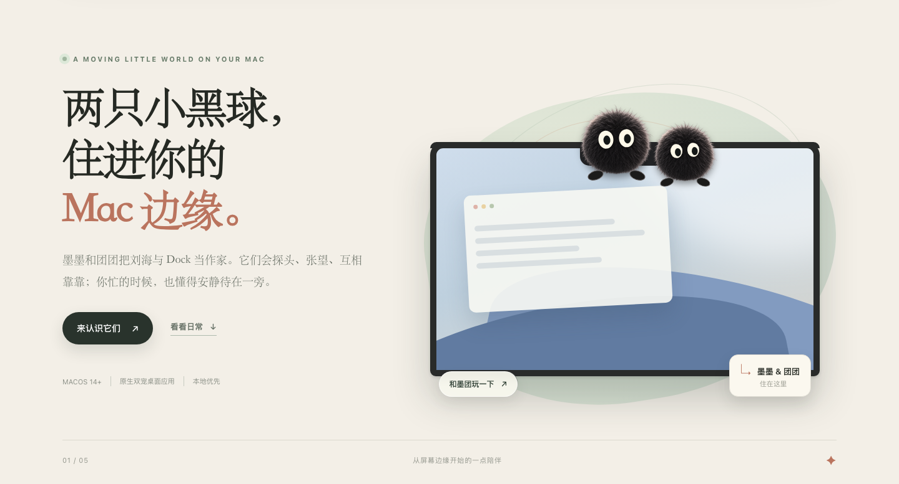
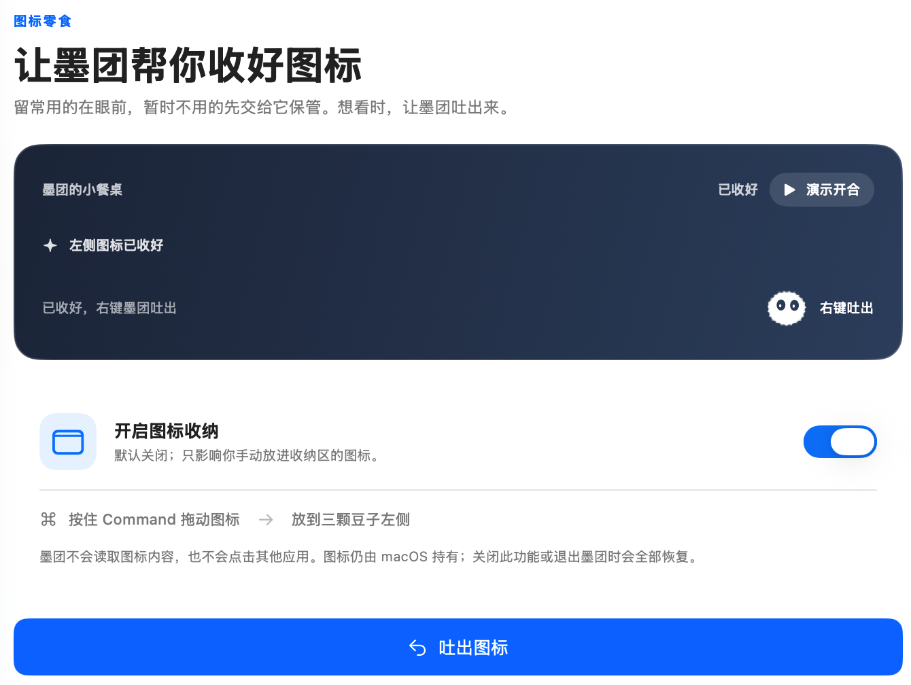
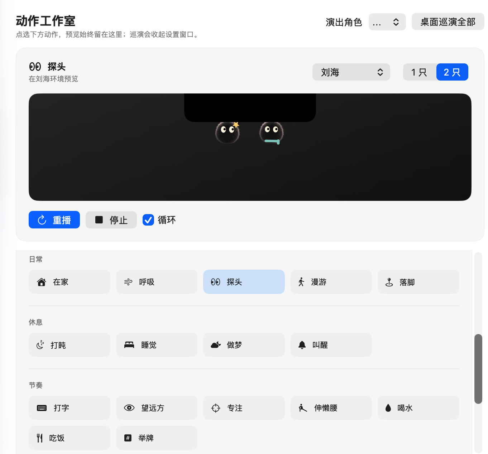

  

<h1 align="center">墨团 · SootPet</h1>

两只小黑球，住进你的 Mac 边缘。

  简体中文 · <a href="README.en.md">English</a> 
  <a href="https://github.com/dean0228/sootpet-releases/releases/download/v0.0.1-build54/SootPet-0.0.1.dmg">下载 Mac 修复版</a> ·
  <a href="https://sootpet.com/download/mac">官网下载入口</a> ·
  <a href="https://github.com/dean0228/sootpet-releases/releases/tag/v0.0.1-build54">版本详情</a> ·
  <a href="#安装与更新">安装说明</a>

墨墨好奇、活泼，团团慢热、爱困。它们把 MacBook 的刘海当作家；没有刘海或接上外接屏，就搬到 Dock 边。你忙的时候安静陪着，空闲时探头、张望、互相靠靠——让平常的工作日多一点小小的回应。

**macOS 原生 · 本地优先 · 简体中文 / English**

## 不打扰，也有回应

- **住在屏幕边缘。** 刘海、Dock 或你喜欢的屏幕边缘，都能成为小家。拖起放下，看看它们如何扒住边缘、探头张望。
- **按自己的节奏陪伴。** 选择安静、自然或活泼；一只或两只，都由你决定。窗口漫步可按需开启。
- **一起专注，记得休息。** 25 分钟专注陪伴，加上可调整间隔的温柔提醒。伸个懒腰、看看远方，小家伙用举牌提醒你。
- **给日常一点惊喜。** 可预览动作，试试小星星、围巾，或让它们一起演出生活片段。

## 图标零食：桌面清爽一点

暂时不用的菜单栏图标，先交给墨团保管。开启后按住 Command，把想收起的图标拖到墨团左侧；右键喂入或吐出，左键仍打开墨团面板。关闭功能或退出墨团时恢复显示。

## 每一下认真，都算数

按键陪伴开启后，查看今日、本周和累计次数，以及近 7 天或 30 天的变化。每累计 100 次按下，两只轮流举牌，展示约 4–5 秒，给你一个小小的回应。

只统计**按下次数**，不是文字字数；不记录你打了什么。

## 慢慢点亮，属于你们的成就

陪伴、专注和日常互动，逐渐点亮成就徽章。点击徽章，查看故事、条件与当前进度，不用把陪伴变成任务清单。

看看动作工作室：小小动作，先试给你看

在动作工作室预览墨团的生活片段，选择喜欢的动作，再带回桌面。

*上方功能截图来自真实应用；顶部场景为宣传示意。截图中的统计与进度是展示数据。*

## 隐私，留在这台 Mac

- 按键陪伴、窗口漫步和图标零食都默认关闭，由你主动开启。
- 按键功能需 macOS「输入监控」授权；只保存次数，不保存字符、键码、组合键或当前应用。
- 窗口漫步仅即时使用窗口位置与大小等必要信息，不读取标题或画面，不保存移动轨迹。
- 图标零食仅调整墨团自己的菜单栏项，不读取或点击其他应用图标，不改写它们的系统排序偏好。
- 不读取屏幕内容，不使用摄像头或麦克风，不上传行为数据。偏好和统计保存在本机。
- 更新检查和安装包下载连接 GitHub，不附带行为统计或设备标识。

## 安装与更新

当前版本 **v0.0.1（Build 54）**，适用于 **Apple 芯片（M 系列）/ macOS 14 及更新版本**。

Build 54 包含图标零食循环开合及入口宽度的修正；实际兼容性仍在持续验证。官网 Mac 下载入口现已同步 Build 54，本机后续候选不等于公开发布。

这是 **Ad Hoc 未公证公开测试版**，没有经过 Apple 公证。首次打开可能被 macOS 拦截；请确认下载来源，按系统提示操作，不要关闭 Gatekeeper 或系统安全保护。

1. [下载 SootPet-0.0.1.dmg（Build 54）](https://github.com/dean0228/sootpet-releases/releases/download/v0.0.1-build54/SootPet-0.0.1.dmg)，打开后将墨团拖到「应用程序」。
2. 已有旧版时，先退出，再替换原来的墨团；原有名字、统计、成就和设置继续使用。
3. 打开墨团。如果 macOS 拦截，按系统提示到「系统设置 → 隐私与安全性」选择「仍要打开」；只对你确认来源的安装包这样操作。
4. 在「设置 → 应用信息 → 界面语言」选择跟随系统、简体中文或 English。
5. 按键统计更新后若不可用，在系统「输入监控」中允许当前安装版本，再按 macOS 提示重开。

在「设置 → 应用信息」检查更新、阅读说明并下载安装包。安装前会验证更新清单签名和安装包完整性，最终替换由你确认；这项校验不等同于 Apple 公证。

[查看版本说明](https://github.com/dean0228/sootpet-releases/releases/tag/v0.0.1-build54) · [校验安装包](https://github.com/dean0228/sootpet-releases/releases/download/v0.0.1-build54/SHA256SUMS) · [反馈问题](https://github.com/dean0228/sootpet-releases/issues)

---

这是一份面向用户的产品介绍与下载页。让墨团住进桌面，也让工作日柔软一点。
